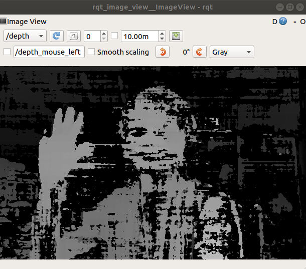

# DEPTHAI-MAPPING
Mapping for Depthai camera modules with depth image extraction, produces local map

**Using**

`Ubuntu` : 18.04

`opencv` : 3.2.0

`gcc and g++` : 7.5.0

`depthai-core` : v2.15.3

**Sample**



---
## Download Dependencies
**NOTE for operations in 18.04**

Default opencv on **18.04** is `3.2.0+dfsg-4ubuntu0.1`
- OpenCV does not support `CV_16FC1` and `CV_16FC3`
- Only way to compile `depthai-core` is to comment out the lines that involve `CV_16FC1` and `CV_16FC3` in the switch function in `ImgFrame.cpp`

- In `depthai-core` CMakeLists.txt, Depthai may not detect OpenCV, hence we force the OPENCV_SUPPORT to always be true 
```bash
#configure 
set(OPENCV_SUPPORT_AVAILABLE TRUE)
...
# Remove the if and else and to just run it
if(DEPTHAI_OPENCV_SUPPORT)
```

**Step 1** Setup **Depthai-core** for c++ libraries in your local system
```bash
sudo apt-get install -y libusb-1.0-0-dev libopencv-dev
git clone https://github.com/luxonis/depthai-core.git
cd depthai-core
git checkout v2.15.3
git submodule update --init --recursive
cmake -H. -Bbuild
cmake --build build
cd build
sudo make install
```

## Notes
0. Basic pipeline for Depthai https://learnopencv.com/introduction-to-opencv-ai-kit-and-depthai/ 
1. https://docs.luxonis.com/projects/api/en/latest/samples/StereoDepth/depth_preview/#depth-preview
2. Mapping guide from https://medium.com/the-inverse-project/opencv-spatial-ai-competition-progress-journal-part-ii-d27dba265be4 and https://github.com/InverseProject/pose-landmark-graph-slam